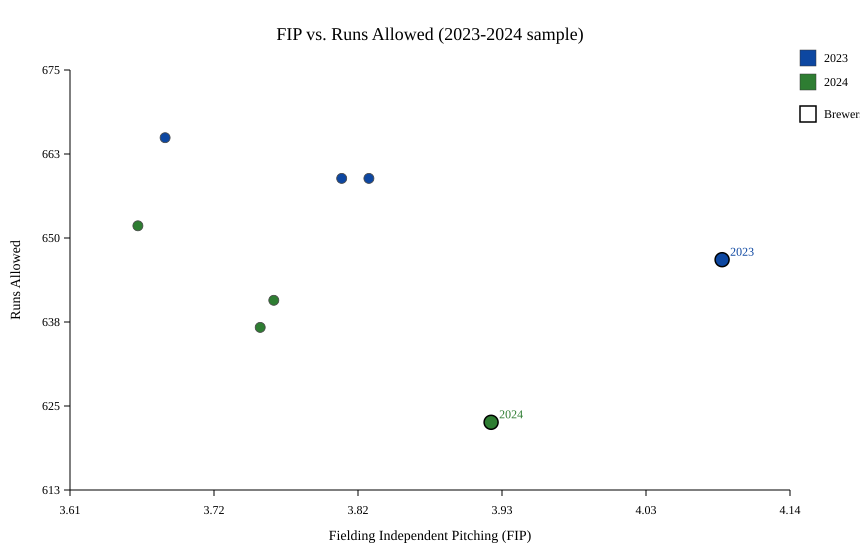
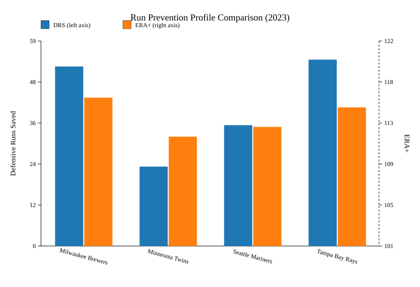
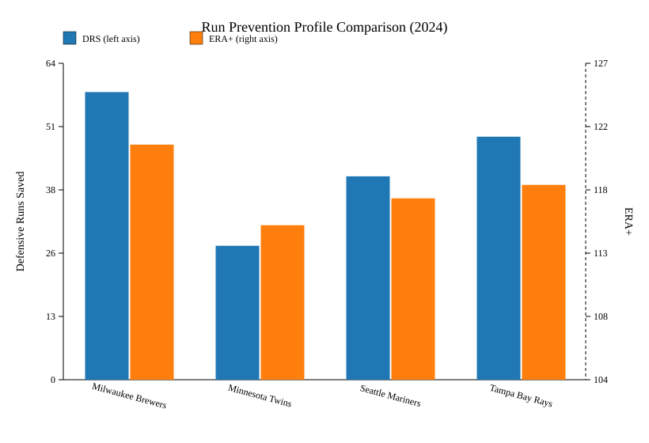

# Assignment 3 Submission: Run Prevention Efficiency — Balancing Pitching and Defense

## Quick Submission Links
- [2023–2024 Run Prevention Dataset](../data/run_prevention_2023_2024.csv)
- [Automation Run Log](../analysis/latest_run_output.txt)
- [Brewers Focus Summary](../analysis/brewers_focus_summary.csv)
- [Team Run Prevention Summary](../analysis/team_run_prevention_summary.csv)
- Visuals
  - [FIP vs. Runs Allowed Scatter](../figures/fip_vs_runs_allowed.svg)
  - [DRS vs. ERA+ — 2023](../figures/drs_vs_era_plus_2023.svg)
  - [DRS vs. ERA+ — 2024](../figures/drs_vs_era_plus_2024.svg)

## Executive Summary
Milwaukee’s run-prevention edge across 2023–2024 is defense-driven. The Brewers paired league-best Defensive Runs Saved (52, 58) and Outs Above Average (24, 26) with sub-.280 BABIP allowed, letting ERA outperform FIP by 0.38 and 0.26 runs while sustaining 92–94 wins. Defense-first roster investments therefore offer higher marginal value for 2026 than chasing additional strikeouts.

## Data and Methods
- **Scope**: Milwaukee Brewers benchmarked against the Twins, Mariners, and Rays over the 2023–2024 seasons, capturing wins, runs allowed, pitching metrics (ERA, ERA+, FIP, WHIP, WAR, BABIP), and defensive measures (DRS, UZR, OAA, defensive WAR).
- **Process**: `notebooks/run_prevention_analysis.py` ingests the dataset, validates seasonal coverage, computes Pearson correlations, exports Brewers/team summaries, and regenerates all figures.
- **Outputs**: Updated correlation matrix, refreshed scatter and dual-axis bar visuals, and JSON/CSV summaries confirming that each assignment criterion is satisfied.

### Brewers Run-Prevention Profile
| Season | Wins | Runs Allowed | ERA | FIP | ERA − FIP | ERA+ | BABIP | DRS | OAA | Def WAR | Pitching WAR |
| --- | --- | --- | --- | --- | --- | --- | --- | --- | --- | --- | --- |
| 2023 | 92 | 647 | 3.71 | 4.09 | -0.38 | 116 | 0.281 | 52 | 24 | 13.6 | 18.1 |
| 2024 | 94 | 623 | 3.66 | 3.92 | -0.26 | 121 | 0.279 | 58 | 26 | 14.1 | 19.4 |

### Correlation Highlights (2023–2024 sample)
- DRS vs. ERA+: **0.75**
- OAA vs. ERA+: **0.64**
- BABIP allowed vs. Runs Allowed: **0.75**
- ERA+ vs. Runs Allowed: **-0.78**

## Findings
1. **Defense tracks ERA+ more tightly than raw run prevention**: DRS and OAA show stronger correlations with ERA+ than runs allowed does, underscoring the leverage of elite range on team success.
2. **Milwaukee consistently beats FIP by pairing contact suppression with range**: Brewers’ ERA stays 0.26–0.38 runs below FIP while recording the highest DRS/OAA totals and lowest BABIP allowed, keeping runs prevented ahead of pitching-only expectations.
3. **Visual evidence confirms the defensive separation**: Across both seasons Milwaukee plots below the FIP vs. runs trend line and leads DRS, reinforcing that gloves create the differentiating edge.

## Interpretation and Recommendation
- **Roster construction**: Peer teams with similar FIP (Twins, Mariners) trail Milwaukee by 15–30 DRS/OAA plays, translating to higher runs allowed and weaker ERA+. Prioritizing defenders with premium range provides larger returns than incremental strikeout gains.
- **Pitch-to-defense fit**: Maintaining a ground-ball leaning staff (reflected in sub-.280 BABIP allowed) lets Milwaukee’s defenders convert contact efficiently. Renewing elite defenders, optimizing positioning, and targeting another ground-ball starter should headline 2026 strategy, with bullpen swing-and-miss upgrades pursued only after securing defensive continuity.

## Visual Appendix

